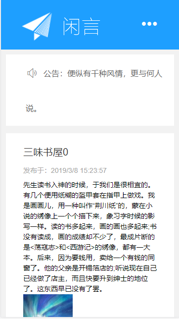
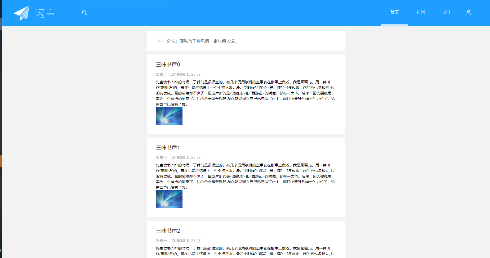

#### 轻量级博客(目前只有前台）
- 基于Asp.Net Core + [XCode](https://github.com/NewLifeX/X) + [LayUI](https://www.layui.com/)
- 使用数据库框架[XCode](https://github.com/NewLifeX/X)的入门级项目，没有什么太高级的写法，仅做入门参考,希望可以对你入门XCode有一丝的帮助

#### 效果图

#### 后台设计
1.参考[YuukoBlog](https://github.com/PomeloFoundation/YuukoBlog)
* A light-weight single user blog system which based on ASP.Net Core 2.0.0
* 代码主要贡献者yukozh，微软2016年MVP，[博客地址](http://www.1234.sh)
* 支持三种模板选择

2.数据库
* 只有两个表Catalogs和Posts
* 使用ORM框架[Newlife.XCode](https://doc.newlifex.com/XCode/)
    * 设计好数据模型,参考 Models/Model.xml
    * 运行tt工具生成实体模型(一个数据表会有两个分部类文件)，模型里的索引会自动创建扩展查询方法，外键字段自动生成扩展属性，全自动！(Posts表-Catalogs属性）
       * 因为[XCode](https://github.com/NewLifeX/X)是倡导单表查询，所以一般多表查询是通过扩展属性来进行联合查询数据
    * 分页查询(Posts表-PageView方法）
    * 种子数据(InitData）
       
#### 前台模板
1.[LayUI模板市场闲言轻博客模板](https://fly.layui.com/store/layuiXianyan/)
 * 基于 layui 搭建而成，响应式，轻量极简

#### 如何启动
- 数据库链接 appsettings.json-ConnectionStrings(配置文件需要右键设置属性复制到输出目录）
- 一键启动项目运行，数据库会反向生成，目前支持SQLite,MySql,Ms SqlServer(如果连接不正确，会默认创建Sqlite数据库）

#### 线上地址
* 等待部署

###### 我希望有个如你一般的人，如山间清爽的风，如古城温暖的光，从清晨到夜晚，从山野到书房，等待不怕岁月蹉跎，不怕路途遥远，只要最后是你就好。
